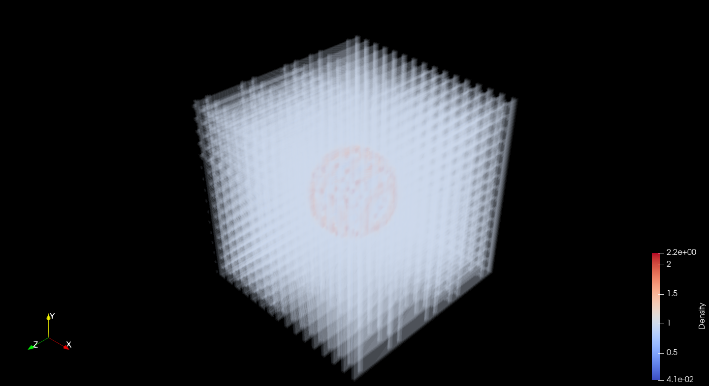
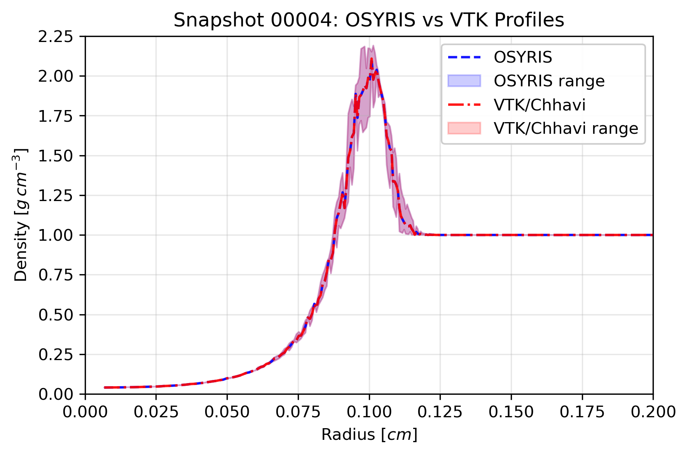

## Summary

`Chhavi` is a Python-based tool that converts simulation outputs generated by the `RAMSES` astrophysical code into the widely supported `VTKHDF` format. It enables direct and efficient visualization of simulation data in `ParaView` and other compatible platforms by translating `RAMSES`’s complex native binary outputs into a clean, hierarchical structure suited for interactive exploration.

`RAMSES`, an adaptive mesh refinement simulation framework used to study galactic evolution and interstellar structures, produces highly detailed yet visualization-intensive data. `Chhavi` reconstructs this multi-level structure while preserving essential physical quantities such as density, pressure, and velocity, allowing researchers to interpret large-scale cosmic simulations with clarity.

This tool provides a bridge between high-resolution simulations and interactive visualization workflows, improving reproducibility and interoperability within computational astrophysics—making advanced simulation data easier to interpret and visualise within open-science ecosystems.

## Statement of Need

Astrophysical simulations are essential for studying the formation and evolution of structures within our universe at various scales. `RAMSES`, a high‑resolution simulation framework, uses adaptive mesh refinement `AMR` to model physical processes such as interstellar filament evolution and galactic dynamics. However, its complex binary output format makes direct visualization and interpretation of results challenging for researchers.

Existing tools for `RAMSES` data visualization, including `yt` and `Osyris`, offer solutions but often require extensive configuration, manual interventions and fail to provide a graphical interface to enable rapid priliminary visual analysis of the simulation outputs. These limitations reduce accessibility and complicate the scientific workflow, particularly for large‑scale three-dimensional datasets.

`Chhavi` addresses this challenge through a Python‑based, open‑source tool that converts `RAMSES` outputs into the `VTKHDF` format, which is natively supported by the latest versions of `ParaView` and other softwares that support the `VTK` architecture. This conversion enables multi‑resolution 3D visualization while preserving essential physical quantities such as density, pressure, velocity and many more. By automating data conversion and maintaining structural fidelity, `Chhavi` promotes open, reproducible, and accessible visualization workflows in computational astrophysics.

## Functionality Overview

`Chhavi` converts outputs from the `RAMSES` astrophysical code into the `VTKHDF` `OverlappingAMR` format, enabling detailed visualization in `ParaView`.

The conversion process involves the following key steps:

1. **Data Extraction:** The tool reads `RAMSES` simulation outputs using libraries like `Osyris` and `h5py`, accessing the hierarchical adaptive mesh refinement `AMR` grid and the associated physical fields.

2. **AMR Hierarchy Reconstruction:** It reorganizes simulation cells according to their refinement levels, preserving the multi-scale spatial structure critical for accurate scientific interpretation.

3. **Field Mapping:** Key scalar and vector fields—including density, pressure, velocity, magnetic field, and gravitational potential—are extracted and assigned to corresponding grid cells without interpolation or modification.

4. **VTKHDF Generation:** The hierarchical data is encoded into a single `.vtkhdf` file, maintaining the `AMR` structure and enabling efficient storage and loading.

5. **Visualization:** The generated `VTKHDF` file can be loaded directly into `ParaView`, where researchers can explore simulation data interactively, leveraging multi-resolution visualization to analyze cosmic phenomena.

Users interact with `Chhavi` via a command-line interface `CLI` or `Python API`, with flexible options for input directories, output directories, field selection, output file prefixes, number of CPU cores for parallel conversion and a dry-run mode for previewing conversions. The package also includes an automated test suite that ensures reliability and reproducibility of the conversion process.

## Syntax Example

`Chhavi` converts `RAMSES` simulation outputs to `VTKHDF` format using either a command-line interface (CLI) or a Python API.

### Command-Line Interface

Convert the first snapshot of the `sedov_3d` dataset with key scalar and vector fields:

    python -m chhavi.cli --base-dir ramses_outputs/
    --folder-name sedov_3d/ -n 1
    --output-prefix sedov_test
    --fields density,velocity,pressure
    --output-dir ./vtk_outputs
    --nproc 1

Add `--dry-run` to preview the conversion without writing output files.

### Python API

Programmatically perform the same conversion:

    from chhavi.converter import ChhaviConverter
    converter = ChhaviConverter(
    input_folder="ramses_outputs/sedov_3d",
    output_prefix="sedov_test",
    fields=["density","velocity", "pressure"],
    dry_run=False,
    output_directory="./vtk_outputs"
    )
    converter.process_output(1)

For full usage details, kindly refer the [GitHub repository](https://github.com/HemangiVarkal/Chhavi).

## Results and Performance

`Chhavi`'s performance was assessed using `RAMSES` test dataset, the `Sedov 3D` blast wave.

The `Sedov 3D` dataset served primarily for validation of the conversion process, as it provides a simple spherically symmetric dataset that can be compared by analysing the physical properties as a function of radial separation for the center of the computational domain. The radial profile also helps us probe whether the conversion process is able to preserve the symmetricity of the solution as generated by `RAMSES`. 

We compute the radial profile of density for both the native output from `RAMSES` and the `VTKHDF` converter `Chhavi`. For each radial bin we see an overlap not just of the mean value of density but also of the error bars of density. Further we evaluate the `Lin's Concordance Correlation Coefficient` to test how well both the profiles follow each other, our conversion passes this test as well. Thus, we can conclude that our conversion process conserves both the `AMR` structure of the solution and also maintains the inherent symmetry of the solution precisely.

Notably, memory usage becomes a primary consideration during visualization in `ParaView`, especially for large `AMR` datasets. `ParaView` loads the hierarchical data progressively, but large datasets can demand considerable RAM, potentially impacting interactive visualization performance. Therefore, while `Chhavi` outputs are optimized for structure and fidelity, users should consider hardware limitations when exploring extensive datasets.

Overall, `Chhavi` provides a robust and reproducible solution for astrophysical simulation post-processing, balancing accuracy with practical performance.

|  |  |
|:--:|:--:|
| **Figure 3:** Volume rendering of `Sedov 3D` output at timestep 00004. | **Figure 4:** Radial Profile Plot of `Sedov 3D` output at timestep 00004. |

## Acknowledgements

This work was done as part of an internship project at the Space Applications Centre (SAC). The authors acknowledge the critical feedback provided by Asif M. Mandayapuram during the course of this work. The authors express their gratitude to Dr. Rashmi Sharma (DD, EPSA) for their encouragement and support during the course of this work.

The authors also acknowledge the facilities and resources provided by the Space Applications Centre (SAC), Indian Space Research Organisation (ISRO), Ahmedabad. The computations required for this work were performed using the SAGAR High Performance Computing (HPC) Facility of SAC.

## References
